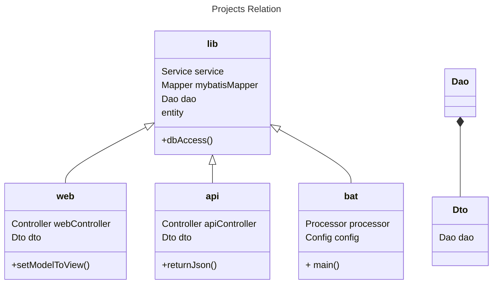

# sp_boot
Spring Boot multi projects ([web](#web), [api](#api), [bat](#bat) and [lib](#lib)) repository example.

    Dao can be used by Dto for example, view condition is same as db search condrion.

## web
web project is Spring Web for MVC to retuen view with server side rendering.
## api
api project is Spring Web for Rest to get Json responces.
## bat
bat project is Spring Batch for heavy process to take times.
## lib
lib project is a library project, other projects use this project for business to access DB.
